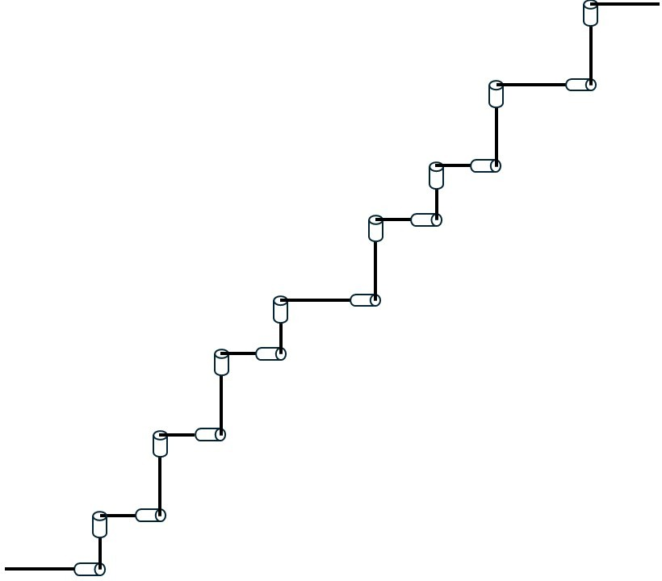

# Snake Cube Puzzle solver
A Snake Cube Puzzle solver that leverages robotic manipulators' direct kinematics and a backtracking algorythm with pruning.

## Puzzle design
The snake cube can be modeled as a robotic manipulator consisting of 17 rigid links and 16 rotational joints as in the figure below. 
This means that the snake configuration, therefore the positions taken by its 27 cubes, can be uniquely determined by a vector $Q$ of 16 angles, 
each one referring to the angle of the corrispondent rotational joint. The transformation of $Q$ to the position of the cubes can be performed
through the robotic manipulators' direct kinematics formulas after the initialization of the joints' frames and the complete list of 
Denavit-Hartenberg parameters. 

<p align="center">
    
    
</p>

For simplicity, we assume that each rotational joint can have a value between 0, $\frac{\pi}{2}$, $\pi$ and $\frac{3\pi}{2}$. The set of all the possible
configuration of the snake is therefore composed of all the combinations of those values for each rotational joint, that is, $4^{16}$ possible solutions.
The easiest way to search for a configuration that solves the puzzle would be performing a greed search on that configuration space. However, this method
would need a huge amount of time: with an hypotetical (and optimistic) run time of 1ms to check if a combination is a valid solution, the exploration of
the whole solution space would require about 50 days. It is then necessary to adopt a more efficient search method.

The whole solution space can be represented as a big tree, as shown in the figure below. Each leaf of the tree represents a unique configuration of the snake,
so a unique joint angles vector $Q$. The intermediate nodes, distributed on 15 levels, represent a part of the snake: for example, nodes in the 5th layer
represent the configuration of the first 6 links and 5 joints of the snake. The child of a node in the $m$-th layer has the the first $m$ joints with the same 
angle values of the parent node and adds the next joint with its angle. The configurations are encoded by a string of digits, each one going from 0 to 3, that 
indicates the value of the corrispondent joint as a multiple of $\frac{\pi}{2}$. For example, the node '03120' stands for the configuration derived by the 
joint angles vector $q=[0 \quad \frac{3\pi}{2} \quad \frac{\pi}{2} \quad \pi \quad 0]$

<p align="center">
    
</p>

A configuration, to be a valid puzzle solution, needs to meet strict requirements: the space occupied by all the snake's cubes must be a 3x3x3 cube, and 
there must not be any interference between them. With these hard constraints, it's possible that just after setting the first $m$ joints of the snake
the configuration is already invalid, so any other configuration that starts with that values for the first $m$ joints is invalid too. With this basis idea,
a **backtracking** algorythm with **tree pruning** has been adopted.

The main idea is that if during the exploration of the tree an invalid node is met, we _prune_ the subtree that generates from that node and do not explore 
all the configurations that it contains. Instead, we _backtrack_ to the last explored configuration and carry on the exploration. Considering that in this
domain the invalid solutions are way more than the valid ones, this method allows to drastically reduce the computational costs of the research. 

<p align="center">
    
</p>

The implemented backtracking with pruning algorythm is described by the pseudocode below, together with the funtion used to update the solution.

<p align="left">
    
</p>
<p align="left">
    
</p>

## Usage
Install the required packages by running the following command in the terminal
```
pip install -r requirements.txt
```
Then run the main script
```
python cube_solver.py
```

At the end, a directory named _solutions_ will be created, in which you'll find a list of images with the solution of the puzzle and a .txt named _solutions_
with the strings corresponding to the found configurations
